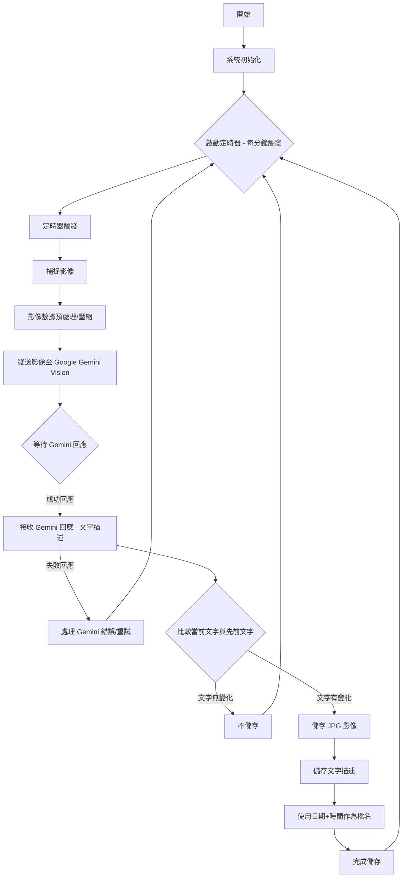

# AI 監視錄影系統

本報告旨在介紹一個基於邊緣 AI 技術的輔助回收系統。該系統利用 Realtek AMB82_mini 微控制器作為核心處理單元，整合影像辨識與語音互動功能，旨在實現對回收物品的自動識別與語音指引，從而提升回收效率與正確性。


- [AI 監視錄影系統](#ai-監視錄影系統)
  - [功能](#功能)
  - [GenAI程式碼設計流程](#genai程式碼設計流程)
  - [程式碼產生提示](#程式碼產生提示)
  - [程式碼](#程式碼)
  - [實作成果](#實作成果)
    - [Demo 數據](#demo-數據)

## 功能

1) 每分鐘捕捉影像並傳送至 Gemini Vision (1 分鐘拍攝)

2) 如果回覆文字沒有變化，則不儲存 jpg 和文字如果回應的文字與先前的場景不同，則儲存 jpg 和文字(使用日期+時間作為檔案名稱）


## GenAI程式碼設計流程



## 程式碼產生提示
**給AI的提示詞**：

    我給你兩份範例代碼請幫我結合 並符合以下要求

    1）每分鐘捕捉影像並發送給Gemini Vision（1分鐘拍攝）

    2）如果回覆文字沒有變化，則不儲存 jpg 和文字

    如果回應的文字與先前的場景不同，則儲存 jpg 和文字 

    （使用日期+時間作為檔案名稱）

    1.  GenAIVision.ino

    2.  CaptureJPG_SDcard.ino

## 程式碼


``` c
#include "VideoStream.h"
#include "AmebaFatFS.h"
#include <WiFi.h>
#include "GenAI.h"
#include "rtc.h"    // Correct library for AmebaPro2 RTC
#include <time.h>   // Still needed for struct tm and localtime()

// --- Configuration Defines ---
#define CHANNEL 0
#define CAPTURE_INTERVAL_MS 60000 // 1 minute in milliseconds

// --- API Keys and Wi-Fi Credentials (from your provided code) ---
String Gemini_key = ""; // Your Gemini API key
char wifi_ssid[] = "";// Your Wi-Fi network SSID
char wifi_pass[] = "";// Your Wi-Fi network password

// --- RTC Initial Time Settings ---
// These values will be used to set the RTC initially when the board powers on.
// Adjust these to your current date and time for accurate timestamps.
#define INITIAL_YEAR  2024
#define INITIAL_MONTH 5
#define INITIAL_DAY   22
#define INITIAL_HOUR  20
#define INITIAL_MIN   40
#define INITIAL_SEC   0

// --- Global Objects and Variables ---
WiFiSSLClient client;
GenAI llm;

// Camera settings: 768x768 resolution, optimized for vision models
VideoSetting config(768, 768, CAM_FPS, VIDEO_JPEG, 1);

uint32_t img_addr = 0; // Pointer to the image data in memory
uint32_t img_len = 0;  // Length of the image data

AmebaFatFS fs; // File system object for SD card operations
File file;     // File object for reading/writing to SD card

String prompt_msg = "Please describe the image, and if there is a text, please summarize the content";
String previous_gemini_response = ""; // Stores the last Gemini response for comparison
unsigned long last_capture_time = 0;  // Tracks the time of the last image capture

// --- Function to initialize Wi-Fi connection ---
void initWiFi() {
  Serial.println("Connecting to WiFi...");
  WiFi.begin(wifi_ssid, wifi_pass); // Start Wi-Fi connection

  uint32_t StartTime = millis();
  while (WiFi.status() != WL_CONNECTED) {
    delay(500); // Wait a bit before checking again
    Serial.print(".");
    if ((millis() - StartTime) > 15000) { // Timeout after 15 seconds
      Serial.println("\nWiFi connection timed out. Please check credentials and try again.");
      // In a real application, you might want to restart or go into a low-power mode here.
      while(true); // Halt execution if WiFi fails after timeout
    }
  }
  Serial.println("\nWiFi connected!");
  Serial.print("STA IP address: ");
  Serial.println(WiFi.localIP());
}

// --- Setup Function: Runs once at startup ---
void setup() {
  Serial.begin(115200); // Initialize serial communication for debugging

  // Initialize Wi-Fi
  initWiFi();

  // Initialize RTC and set initial time
  rtc.Init(); // Initialize the RTC module
  // Set the initial epoch time for the RTC
  long long epochTime = rtc.SetEpoch(INITIAL_YEAR, INITIAL_MONTH, INITIAL_DAY, INITIAL_HOUR, INITIAL_MIN, INITIAL_SEC);
  rtc.Write(epochTime); // Write the set epoch time to the RTC hardware
  Serial.print("RTC initialized to: ");
  // Print current time from RTC for verification
  time_t current_rtc_time = rtc.Read(); // Read current time from RTC
  struct tm * timeinfo = localtime(&current_rtc_time); // Convert to local time structure
  Serial.println(asctime(timeinfo)); // Print formatted time

  // Configure and initialize the camera
  config.setRotation(0); // Set camera rotation if needed (0 for no rotation)
  Camera.configVideoChannel(CHANNEL, config);
  Camera.videoInit();
  Camera.channelBegin(CHANNEL);
  Camera.printInfo(); // Print camera information to serial

  // Initialize SD card file system
  if (!fs.begin()) {
    Serial.println("Failed to initialize SD card! Please check connection and format.");
    // Handle SD card initialization failure (e.g., halt, retry)
    while (true); // Halt execution if SD card fails
  }
  Serial.println("SD card initialized successfully.");
  Serial.print("SD card root path: ");
  Serial.println(fs.getRootPath()); // Print the actual root path for debugging

  // Set initial capture time to ensure an immediate capture on startup
  // Subtracting CAPTURE_INTERVAL_MS makes the first capture happen immediately in loop()
  last_capture_time = millis() - CAPTURE_INTERVAL_MS;
}

// --- Loop Function: Runs repeatedly ---
void loop() {
  unsigned long current_time_millis = millis(); // Get current uptime in milliseconds

  // Check if it's time to capture a new image (every minute)
  if (current_time_millis - last_capture_time >= CAPTURE_INTERVAL_MS) {
    last_capture_time = current_time_millis; // Update the last capture time to now

    Serial.println("\n--- Capturing Image ---");
    Camera.getImage(CHANNEL, &img_addr, &img_len); // Capture image data into memory

    if (img_len == 0) {
      Serial.println("Failed to capture image (length is 0). Skipping Gemini Vision.");
      delay(1000); // Wait a bit before trying again to avoid rapid failures
      return;      // Skip the rest of the loop for this iteration
    }

    Serial.println("Sending image to Gemini Vision...");
    // Call Gemini Vision API with the captured image data and prompt
    String current_gemini_response = llm.geminivision(Gemini_key, "gemini-2.0-flash", prompt_msg, img_addr, img_len, client);
    
    Serial.print("Gemini Response: ");
    Serial.println(current_gemini_response);

    // Compare the current Gemini response with the previous one
    // Also ensure the current response is not empty before storing
    if (current_gemini_response != previous_gemini_response && current_gemini_response.length() > 0) {
      Serial.println("Gemini response is different from previous or not empty. Storing image and text.");

      // Get current date and time from RTC for filename
      time_t t = rtc.Read(); // Get current epoch time (Unix timestamp) from the RTC
      struct tm * timeinfo = localtime(&t); // Convert epoch time to a broken-down time structure

      // Increased buffer size to 64 to prevent sprintf overflow warnings
      char filename_date_time[30]; // Buffer for just the date_time part of the filename
      char full_filename_buffer[64]; // Larger buffer for the full path

      // Create the date_time part of the filename: YYYYMMDD_HHMMSS
      sprintf(filename_date_time, "%04d%02d%02d_%02d%02d%02d", 
              timeinfo->tm_year + 1900,  // Add 1900 to get full year
              timeinfo->tm_mon + 1,      // Add 1 to get month (1-12)
              timeinfo->tm_mday,         // Day of the month
              timeinfo->tm_hour,         // Hour (0-23)
              timeinfo->tm_min,          // Minute (0-59)
              timeinfo->tm_sec);         // Second (0-59)

      // Get the root path from the SD card file system
      String rootPath = fs.getRootPath();
      // Ensure rootPath does not end with a slash if it's not empty, to avoid double slashes
      if (rootPath.length() > 0 && rootPath.endsWith("/") && rootPath != "/") {
          rootPath.remove(rootPath.length() - 1);
      }

      // Construct the full image filename: <rootPath>/YYYYMMDD_HHMMSS.jpg
      sprintf(full_filename_buffer, "%s/%s.jpg", rootPath.c_str(), filename_date_time);
      String image_filename = String(full_filename_buffer);

      // Construct the full text filename: <rootPath>/YYYYMMDD_HHMMSS.txt
      sprintf(full_filename_buffer, "%s/%s.txt", rootPath.c_str(), filename_date_time);
      String text_filename = String(full_filename_buffer);

      // --- Store Image to SD Card ---
      // Open file in write mode using FA_WRITE (correct for AmebaFatFS)
      file = fs.open(image_filename, FA_WRITE); 
      if (file) {
        file.write((uint8_t *)img_addr, img_len); // Write image data from memory to SD card
        file.close(); // Close the file to save changes
        Serial.print("Image stored as: ");
        Serial.println(image_filename);
      } else {
        Serial.print("Error: Could not open image file for writing: ");
        Serial.println(image_filename);
      }

      // --- Store Text to SD Card ---
      // Open file in write mode using FA_WRITE
      file = fs.open(text_filename, FA_WRITE); 
      if (file) {
        file.print(current_gemini_response); // Write the Gemini response text to SD card
        file.close(); // Close the file to save changes
        Serial.print("Text stored as: ");
        Serial.println(text_filename);
      } else {
        Serial.print("Error: Could not open text file for writing: ");
        Serial.println(text_filename);
      }
      
      // Update the previous response for the next comparison
      previous_gemini_response = current_gemini_response;
    } else {
      Serial.println("Gemini response is the same as previous or empty. Not storing image or text.");
    }
  }

  delay(100); // Small delay to prevent busy-waiting and allow other tasks to run
}
```

## 實作成果


### Demo 數據


以下是檔案的詳細資料


    20250522_210653.txt

    The image shows a computer screen displaying a webpage for Anaconda, a Python distribution. The webpage is primarily in Chinese, with some English words such as "Anaconda" and "Install Anaconda on Ubuntu".  The page seems to be showing instructions or information regarding installation and other details related to Anaconda. The computer is in a computer lab setting, with other computers visible in the background.  Several people are partially visible in the background, seemingly working on other computers.


    20250522_210755.txt

    Here's a description of the image:
    The image shows a computer lab or internet cafe setting. The focus is on a  large computer monitor in the foreground, displaying a webpage that is   partially visible and blurry.  The webpage seems to contain text and possibly     an image or advertisement.  Surrounding this main monitor are several other     computer monitors, arranged in rows. The monitors are relatively small compared     to the one in the foreground, and their screens are partially obscured. The     room itself appears to be a typical office or classroom setting, with a white   ceiling, fluorescent lighting, and what look like cubicle partitions partially    visible behind the computers.  A keyboard is visible in the bottom-left corner,    partially obscuring the edge of a laptop.  The overall lighting is bright but  somewhat washed out, likely due to the fluorescent lights.
    The text on the main monitor is unclear and unreadable due to blurriness and    distance.  Therefore, no summary of the webpage's content can be provided.


    20250522_210851.jpg

    The image shows a section of a white ceiling.  There is a long fluorescent light fixture mounted on the ceiling, as well as what appears to be a portion of an air conditioning vent or exhaust fan in the upper right corner. There is no text visible in the image.


