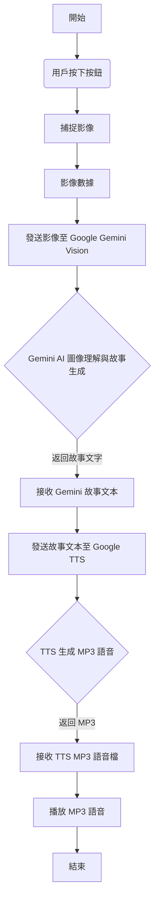

本報告旨在介紹一個創新的AI 看圖說故事系統。該系統旨在將視覺內容轉化為富有想像力的故事情節，為使用者提供獨特的互動體驗。透過按下按鈕捕捉影像，系統會將圖像傳送至強大的 Google Gemini Vision AI 進行分析，並由 AI 根據圖像內容即時編寫一個童話故事


- [功能](#功能)
- [GenAI程式碼設計流程](#genai程式碼設計流程)
- [程式碼產生提示](#程式碼產生提示)
- [程式碼](#程式碼)
- [實作成果](#實作成果)
  - [照片](#照片)
  - [影片](#影片)

## 功能

    1. 按下按鈕即可拍攝影像
    2. 將圖像發送至 Google-Gemini 並回覆訊息
    3. 發送訊息到 Google-TTS 並播放 mp3 檔案進行說話 

## GenAI程式碼設計流程



**流程圖說明：**

* **開始 (Start)：** 系統準備就緒。
* **用戶按下按鈕 (User Presses Button)：** 用戶觸發影像捕捉。
* **捕捉影像 (Capture Image)：** 相機模組捕捉當前畫面。
* **影像數據 (Image Data)：** 獲取的圖像數據。
* **發送影像至 Google Gemini Vision (Send Image to Google Gemini Vision)：** MCU 將圖像上傳到 Google Gemini Vision API。
* **Gemini AI 圖像理解與故事生成 (Gemini AI Image Understanding & Story Generation)：** Google Gemini 在雲端分析圖像並編寫童話故事。
* **接收 Gemini 故事文本 (Receive Gemini Story Text)：** MCU 接收 Gemini 返回的故事文字。
* **發送故事文本至 Google TTS (Send Story Text to Google TTS)：** MCU 將故事文字發送到 Google TTS API。
* **TTS 生成 MP3 語音 (TTS Generates MP3 Audio)：** Google TTS 將文字轉換為 MP3 語音。
* **接收 TTS MP3 語音檔 (Receive TTS MP3 Audio File)：** MCU 接收生成的 MP3 語音檔。
* **播放 MP3 語音 (Play MP3 Audio)：** MCU 透過揚聲器播放語音。
* **結束 (End)：** 一次「看圖說故事」流程完成。

---

## 程式碼產生提示
    我給你一份範例代碼請幫我結合 並符合以下要求

    1. 按下按鈕即可拍攝影像
    2. 將圖像傳送到 Gemini-Vision 並讓 AI 講述童話故事 
    3. 將 Text1 發送到 Google-TTS 並播放 mp3 檔案進行朗讀 
   
    GenAIVision_TTS_TFT.ino

## 程式碼

<**提示字:** *看這張圖 請用中文給我一個簡短的故事*>

``` c
String openAI_key = "";               // paste your generated openAI API key here
String Gemini_key = "";               // paste your generated Gemini API key here
String Llama_key = "";                // paste your generated Llama API key here
char wifi_ssid[] = "";    // your network SSID (name)
char wifi_pass[] = "";        // your network password

#include <WiFi.h>
#include <WiFiUdp.h>
#include "GenAI.h"
#include "VideoStream.h"
#include "SPI.h"
#include "AmebaILI9341.h"
#include "TJpg_Decoder.h" // Include the jpeg decoder library
#include "AmebaFatFS.h"

WiFiSSLClient client;
GenAI llm;
GenAI tts;

AmebaFatFS fs;
String mp3Filename = "test_play_google_tts.mp3";

VideoSetting config(768, 768, CAM_FPS, VIDEO_JPEG, 1);
#define CHANNEL 0

uint32_t img_addr = 0;
uint32_t img_len = 0;
const int buttonPin = 1;          // the number of the pushbutton pin

//String prompt_msg = "What type and name of the recyclables in the picture?";
String prompt_msg = "看這張圖 請用中文給我一個簡短的故事";

#define TFT_RESET 5
#define TFT_DC    4
#define TFT_CS    SPI_SS

AmebaILI9341 tft = AmebaILI9341(TFT_CS, TFT_DC, TFT_RESET);

#define ILI9341_SPI_FREQUENCY 20000000

bool tft_output(int16_t x, int16_t y, uint16_t w, uint16_t h, uint16_t *bitmap)
{
    tft.drawBitmap(x, y, w, h, bitmap);

    // Return 1 to decode next block
    return 1;
}

void initWiFi()
{
    for (int i = 0; i < 2; i++) {
        WiFi.begin(wifi_ssid, wifi_pass);

        delay(1000);
        Serial.println("");
        Serial.print("Connecting to ");
        Serial.println(wifi_ssid);

        uint32_t StartTime = millis();
        while (WiFi.status() != WL_CONNECTED) {
            delay(500);
            if ((StartTime + 5000) < millis()) {
                break;
            }
        }

        if (WiFi.status() == WL_CONNECTED) {
            Serial.println("");
            Serial.println("STAIP address: ");
            Serial.println(WiFi.localIP());
            Serial.println("");
            break;
        }
    }
}

void init_tft()
{
    tft.begin();
    tft.setRotation(2);

    tft.clr();
    tft.setCursor(0, 0);

    tft.setForeground(ILI9341_GREEN);
    tft.setFontSize(2);
}

void setup()
{
    Serial.begin(115200);

    SPI.setDefaultFrequency(ILI9341_SPI_FREQUENCY);
    initWiFi();

    config.setRotation(0);
    Camera.configVideoChannel(CHANNEL, config);
    Camera.videoInit();
    Camera.channelBegin(CHANNEL);
    Camera.printInfo();
    
    pinMode(buttonPin, INPUT);
    pinMode(LED_B, OUTPUT);

    init_tft();
    tft.println("GenAIVision_TTS_LCD");

    TJpgDec.setJpgScale(2); // The jpeg image can be scaled by a factor of 1, 2, 4, or 8    
    TJpgDec.setCallback(tft_output);
}

void loop()
{
    tft.setCursor(0,1);
    tft.println("press button to capture image");
     if ((digitalRead(buttonPin)) == 1) {
        tft.println("Capture Image");       
        // Start MP4 recording after 3 seconds of blinking
        for (int count = 0; count < 3; count++) {
            digitalWrite(LED_B, HIGH);
            delay(500);
            digitalWrite(LED_B, LOW);
            delay(500);
        }
    // Camera take image
        Camera.getImage(0, &img_addr, &img_len); 

    // JPEG decode image & display
        TJpgDec.getJpgSize(0, 0, (uint8_t *)img_addr, img_len);
        TJpgDec.drawJpg(0, 0, (uint8_t *)img_addr, img_len);

    // LLM Vision
        String text = llm.geminivision(Gemini_key, "gemini-2.0-flash", prompt_msg, img_addr, img_len, client);
        Serial.println(text);

    // Text-To-Speech & play mp3 file
        tft.clr();
        tft.setCursor(0, 0);    
        tft.println("Text-To-Speech");
        //tts.googletts(mp3Filename, text, "en-US");
        tts.googletts(mp3Filename, text, "zh-TW");
        delay(500);
        sdPlayMP3(mp3Filename);       
    }
}

void sdPlayMP3(String filename)
{
    fs.begin();
    String filepath = String(fs.getRootPath()) + filename;
    File file = fs.open(filepath, MP3);
    file.setMp3DigitalVol(175);
    file.playMp3();
    file.close();
    fs.end();
}
```

## 實作成果

### 照片

***AI產出的故事***


### 影片

2. Damo影片

[](https://www.youtube.com/watch?v=HFSRFjz1Yuc)  
點擊圖片播放
