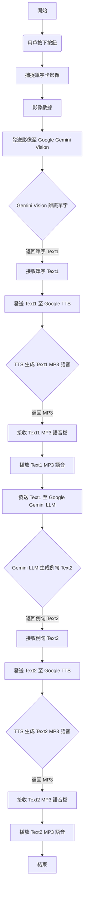

# AI 輔助英語教學

本報告旨在介紹一款創新的AI 輔助英語教學系統，旨在為英語學習者提供即時、互動且個性化的學習體驗。該系統的核心功能是結合視覺辨識、語音合成與自然語言處理能力，模擬一位智能家教。當使用者按下按鈕拍攝單字卡影像後，系統會立即將圖像傳送至 Google Gemini Vision 進行單字辨識，隨後透過系統會將辨識出的單字發送至 Google Gemini LLM，由 AI 即時生成一個例句。


- [AI 輔助英語教學](#ai-輔助英語教學)
  - [功能](#功能)
  - [GenAI程式碼設計流程](#genai程式碼設計流程)
  - [程式碼產生提示](#程式碼產生提示)
  - [程式碼](#程式碼)
    - [程式重點 \<**提示字:** *"Just say the word in the picture?"  \&*"please make a short sentence with"+ word\*](#程式重點-提示字-just-say-the-word-in-the-picture--please-make-a-short-sentence-with-word)
  - [實作成果](#實作成果)
    - [影片](#影片)

## 功能

    1. 按下按鈕即可拍攝影像
    2. 將圖像發送至 Google-Gemini 並回覆訊息
    3. 發送訊息到 Google-TTS 並播放 mp3 檔案進行說話 

## GenAI程式碼設計流程



**流程圖說明：**

* **開始 (Start)：** 系統準備就緒。
* **用戶按下按鈕 (User Presses Button)：** 用戶觸發影像捕捉。
* **捕捉單字卡影像 (Capture Word Card Image)：** 相機模組捕捉單字卡的圖像。
* **影像數據 (Image Data)：** 獲取的圖像數據。
* **發送影像至 Google Gemini Vision (Send Image to Google Gemini Vision)：** MCU 將圖像上傳到 Google Gemini Vision API。
* **Gemini Vision 辨識單字 (Gemini Vision Recognizes Word)：** Google Gemini 在雲端分析圖像並辨識出單字。
* **接收單字 Text1 (Receive Word Text1)：** MCU 接收 Gemini 返回的單字文字 (Text1)。
* **發送 Text1 至 Google TTS (Send Text1 to Google TTS)：** MCU 將單字 (Text1) 發送到 Google TTS API。
* **TTS 生成 Text1 MP3 語音 (TTS Generates Text1 MP3 Audio)：** Google TTS 將單字文字轉換為 MP3 語音。
* **接收 Text1 MP3 語音檔 (Receive Text1 MP3 Audio File)：** MCU 接收生成的 MP3 語音檔。
* **播放 Text1 MP3 語音 (Play Text1 MP3 Audio)：** MCU 透過揚聲器播放單字語音。
* **發送 Text1 至 Google Gemini LLM (Send Text1 to Google Gemini LLM)：** MCU 將單字 (Text1) 發送到 Google Gemini LLM API 以生成例句。
* **Gemini LLM 生成例句 Text2 (Gemini LLM Generates Example Sentence Text2)：** Google Gemini LLM 根據單字生成一個例句。
* **接收例句 Text2 (Receive Example Sentence Text2)：** MCU 接收 Gemini LLM 返回的例句文字 (Text2)。
* **發送 Text2 至 Google TTS (Send Text2 to Google TTS)：** MCU 將例句 (Text2) 發送到 Google TTS API。
* **TTS 生成 Text2 MP3 語音 (TTS Generates Text2 MP3 Audio)：** Google TTS 將例句文字轉換為 MP3 語音。
* **接收 Text2 MP3 語音檔 (Receive Text2 MP3 Audio File)：** MCU 接收生成的 MP3 語音檔。
* **播放 Text2 MP3 語音 (Play Text2 MP3 Audio)：** MCU 透過揚聲器播放例句語音。
* **結束 (End)：** 一次英語教學輔助流程完成。


## 程式碼產生提示

    我給你三份範例代碼請幫我結合 並符合以下要求

      1. 按下按鈕即可拍攝影像
      2. 將圖像傳送到 Gemini-Vision 來讀取單字卡
      3. 將 Text1 發送到 Google-TTS 並播放 mp3 檔案進行朗讀 
      4. 將 Text1 送到 Gemini-LLM 來造句
      5. 將 Text2 發送到 Google-TTS 並播放 mp3 檔案進行說話 
範例:  
[GenAIVision.ino](https://github.com/rkuo2000/EdgeAI-AMB82mini/blob/main/ArduinoAMB82-mini/GenAIVision/GenAIVision.ino)  
[文字轉語音.ino](https://github.com/rkuo2000/EdgeAI-AMB82mini/blob/main/Arduino/AMB82-mini/TextToSpeech/TextToSpeech.ino)  
[ILI9341_TFTLCD_文本.ino](https://github.com/rkuo2000/EdgeAI-AMB82mini/blob/main/Arduino/AMB82-mini/ILI9341_TFTLCD_Text/ILI9341_TFTLCD_Text.ino)


## 程式碼

### 程式重點 <**提示字:** *"Just say the word in the picture?"  &*"please make a short sentence with"+ word*

``` c

String openAI_key = "";                                         // paste your generated openAI API key here
String Gemini_key = "";  // paste your generated Gemini API key here
String Llama_key = "";                                          // paste your generated Llama API key here
char wifi_ssid[] = "";// your network SSID (name)
char wifi_pass[] = "";// your network password

#include <WiFi.h>
#include <WiFiUdp.h>
#include "GenAI.h"
#include "VideoStream.h"
#include "SPI.h"
#include "AmebaILI9341.h"
#include "TJpg_Decoder.h"  // Include the jpeg decoder library
#include "AmebaFatFS.h"

WiFiSSLClient client;
GenAI llm;
GenAI tts;

AmebaFatFS fs;
String mp3Filename = "test_play_google_tts.mp3";

VideoSetting config(768, 768, CAM_FPS, VIDEO_JPEG, 1);
#define CHANNEL 0

uint32_t img_addr = 0;
uint32_t img_len = 0;
const int buttonPin = 1;  // the number of the pushbutton pin

#define TFT_RESET 5
#define TFT_DC 4
#define TFT_CS SPI_SS

AmebaILI9341 tft = AmebaILI9341(TFT_CS, TFT_DC, TFT_RESET);

#define ILI9341_SPI_FREQUENCY 20000000

bool tft_output(int16_t x, int16_t y, uint16_t w, uint16_t h, uint16_t *bitmap) {
  tft.drawBitmap(x, y, w, h, bitmap);

  // Return 1 to decode next block
  return 1;
}

void initWiFi() {
  for (int i = 0; i < 2; i++) {
    WiFi.begin(wifi_ssid, wifi_pass);

    delay(1000);
    Serial.println("");
    Serial.print("Connecting to ");
    Serial.println(wifi_ssid);

    uint32_t StartTime = millis();
    while (WiFi.status() != WL_CONNECTED) {
      delay(500);
      if ((StartTime + 5000) < millis()) {
        break;
      }
    }

    if (WiFi.status() == WL_CONNECTED) {
      Serial.println("");
      Serial.println("STAIP address: ");
      Serial.println(WiFi.localIP());
      Serial.println("");
      break;
    }
  }
}

void init_tft() {
  tft.begin();
  tft.setRotation(0);

  tft.clr();
  tft.setCursor(0, 0);

  tft.setForeground(ILI9341_GREEN);
  tft.setFontSize(2);
}

void setup() {
  Serial.begin(115200);

  SPI.setDefaultFrequency(ILI9341_SPI_FREQUENCY);
  initWiFi();

  config.setRotation(2);
  Camera.configVideoChannel(CHANNEL, config);
  Camera.videoInit();
  Camera.channelBegin(CHANNEL);
  Camera.printInfo();

  pinMode(buttonPin, INPUT);
  pinMode(LED_B, OUTPUT);

  init_tft();
  tft.println("GenAIVision_TTS_ReadWordCard");

  TJpgDec.setJpgScale(2);  // The jpeg image can be scaled by a factor of 1, 2, 4, or 8
  TJpgDec.setCallback(tft_output);

  tft.println("Press Button");
}

void blink_blue(int count) {
  for (int i = 0; i < count; i++) {
    digitalWrite(LED_B, HIGH);
    delay(500);
    digitalWrite(LED_B, LOW);
    delay(500);
  }
}

void loop() {
  if ((digitalRead(buttonPin)) == 1) {
    tft.setCursor(0, 0);
    tft.println("Image captured!");
    blink_blue(2);  // blink
                    // Camera take image

    Camera.getImage(0, &img_addr, &img_len);

    // JPEG decode image & display
    TJpgDec.getJpgSize(0, 0, (uint8_t *)img_addr, img_len);
    TJpgDec.drawJpg(0, 0, (uint8_t *)img_addr, img_len);

    // LLM Vision
    String prompt_msg_img = "Just say the word in the picture?";
    String text = llm.geminivision(Gemini_key, "gemini-2.0-flash", prompt_msg_img, img_addr, img_len, client);
    tft.setCursor(0, 0);
    tft.println(text);

    // Text-To-Speech & play mp3 file
    tts.googletts(mp3Filename, text, "en-US");
    //tts.googletts(mp3Filename, text, "zh-TW");
    delay(500);
    sdPlayMP3(mp3Filename);

    // LLM Text
    String prompt_msg = "please make a short sentence with "+text;
    Serial.println(prompt_msg);
    String txt = llm.geminitext(Gemini_key, "gemini-2.0-flash", prompt_msg, client);    
    tft.println(txt);

    // Text-To-Speech & play mp3 file
    tts.googletts(mp3Filename, txt, "en-US");
    delay(500);
    sdPlayMP3(mp3Filename);

    tft.println("Press Button");
  }
}

void sdPlayMP3(String filename) {
  fs.begin();
  String filepath = String(fs.getRootPath()) + filename;
  File file = fs.open(filepath, MP3);
  file.setMp3DigitalVol(128);
  file.playMp3();
  file.close();
  fs.end();
}
```

## 實作成果

### 影片

Damo影片

[](https://www.youtube.com/watch?v=3WUXcYA3hXg)  
點擊圖片播放
