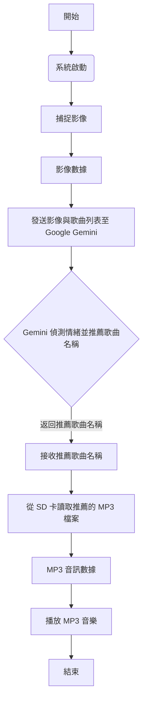

本報告旨在介紹一款創新的AI 情緒感知音樂播放器。該系統旨在透過人工智慧分析用戶當前的情緒狀態，並據此智能推薦並播放儲存在本地 SD 卡中的相應音樂，為使用者提供個性化的音樂聆聽體驗。其核心機制是捕捉用戶影像並傳送至 Google Gemini 進行情緒偵測，隨後 AI 會根據偵測到的情緒，從預設的歌曲清單中推薦最符合當前情感的歌曲名稱。


- [功能](#功能)
- [GenAI程式碼設計流程](#genai程式碼設計流程)
- [程式碼產生提示](#程式碼產生提示)
- [程式碼](#程式碼)
  - [重點](#重點)
- [實作成果](#實作成果)
  - [照片](#照片)
  - [影片](#影片)

## 功能

    1. 抓取影像傳送給Gemini偵測情緒然後要求推薦儲存在SD卡中的歌曲名稱（提示字輸入幾個已經   存在SD卡的歌曲檔名，讓AI去推薦）

    2. 播放MP3文件

## GenAI程式碼設計流程



**流程圖說明：**

* **開始 (Start)：** 系統啟動流程。
* **系統啟動 (System Startup)：** 初始化所有硬體和軟體模組。
* **捕捉影像 (Capture Image)：** 攝影機模組捕捉當前用戶的影像。
* **影像數據 (Image Data)：** 獲取的圖像數據。
* **發送影像與歌曲列表至 Google Gemini (Send Image & Song List to Google Gemini)：** MCU 將圖像數據連同預存的歌曲名稱列表一同發送給 Google Gemini API。
* **Gemini 偵測情緒並推薦歌曲名稱 (Gemini Detects Emotion & Recommends Song Name)：** Google Gemini 分析圖像中的情緒，並根據提示字中的歌曲列表推薦一首匹配的歌曲名稱。
* **接收推薦歌曲名稱 (Receive Recommended Song Name)：** MCU 接收 Gemini 返回的推薦歌曲名稱。
* **從 SD 卡讀取推薦的 MP3 檔案 (Read Recommended MP3 File from SD Card)：** MCU 根據推薦的歌曲名稱，從本地 SD 卡中找到並讀取對應的 MP3 檔案。
* **MP3 音訊數據 (MP3 Audio Data)：** 從 SD 卡讀取到的 MP3 音訊數據。
* **播放 MP3 音樂 (Play MP3 Music)：** MCU 透過音訊輸出模組播放 MP3 音樂。
* **結束 (End)：** 一次情緒感知音樂播放流程完成。


## 程式碼產生提示


## 程式碼

### 重點 
<**提示字:** *```"Analyze the emotion (happy, angry, sad, or joyful) of the person in the image. Based on the detected emotion, recommend a suitable song filename from the following list. Respond in the exact format: 'Emotion: [emotion], Song: [filename.mp3]'. Emotion mapping: Happy: APT.mp3. Angry: BirdsOfAFeather.mp3. Sad: ThePowerOfGoodBye.mp3. Joyful: AstroBunny.mp3. Other songs available: gTTS.mp3, IBelieve.mp3, JarOfLove.mp3, LoversMisses.mp3, Stumblin_In.mp3, YUNGBLUD.mp3."```*>

``` c
// 設定您的 WiFi 網路資訊
char wifi_ssid[] = ""; // 您的 WiFi 名稱 (SSID)
char wifi_pass[] = ""; // 您的 WiFi 密碼
// 設定您的 Gemini API Key
String Gemini_key = ""; // 請在此處替換為您的 Gemini API Key

#include <WiFi.h>
#include <WiFiUdp.h>
#include "GenAI.h"
#include "VideoStream.h"
#include "SPI.h"
#include "AmebaILI9341.h"
#include "TJpg_Decoder.h" // Include the jpeg decoder library
#include "AmebaFatFS.h"

WiFiSSLClient client;
GenAI llm; // 用於 Gemini Vision API
GenAI tts; // 用於 Google Text-to-Speech API

AmebaFatFS fs; // 用於 SD 卡操作

VideoSetting config(768, 768, CAM_FPS, VIDEO_JPEG, 1); // 預設 768x768 解析度
#define CHANNEL 0

uint32_t img_addr = 0;
uint32_t img_len = 0;
const int buttonPin = 1; // 觸發拍照的按鈕引腳 (通常是 D1)
// #define LED_B PC_5 // 板載藍色 LED 引腳 (此行已移除，因為 LED_B 已在核心庫中定義)

// 提示詞 (Prompt): 要求 AI 回覆情緒和歌曲名，並指定明確格式
String prompt_msg = "Analyze the emotion (happy, angry, sad, or joyful) of the person in the image. Based on the detected emotion, recommend a suitable song filename from the following list. Respond in the exact format: 'Emotion: [emotion], Song: [filename.mp3]'. Emotion mapping: Happy: APT.mp3. Angry: BirdsOfAFeather.mp3. Sad: ThePowerOfGoodBye.mp3. Joyful: AstroBunny.mp3. Other songs available: gTTS.mp3, IBelieve.mp3, JarOfLove.mp3, LoversMisses.mp3, Stumblin_In.mp3, YUNGBLUD.mp3.";

// 定義歌曲列表，用於驗證和提取 Gemini 的回覆
const String songList[] = {
    "APT.mp3", "AstroBunny.mp3", "BirdsOfAFeather.mp3", "gTTS.mp3",
    "IBelieve.mp3", "JarOfLove.mp3", "LoversMisses.mp3", "Stumblin_In.mp3",
    "ThePowerOfGoodBye.mp3", "YUNGBLUD.mp3" // 已修正拼寫錯誤
};
const int numSongs = sizeof(songList) / sizeof(songList[0]);


// TFT 顯示器引腳定義
#define TFT_RESET 5
#define TFT_DC 4
#define TFT_CS SPI_SS // CS 引腳通常連接到 SPI_SS

AmebaILI9341 tft = AmebaILI9341(TFT_CS, TFT_DC, TFT_RESET);
#define ILI9341_SPI_FREQUENCY 20000000 // TFT SPI 通訊頻率

// JPEG 圖片解碼回調函數 (用於 TFT 顯示)
// 修正 'h' 參數類型為 uint16_t 以匹配 SketchCallback 類型
bool tft_output(int16_t x, int16_t y, uint16_t w, uint16_t h, uint16_t *bitmap)
{
    tft.drawBitmap(x, y, w, h, bitmap);
    return 1; // Return 1 to decode next block
}

// 初始化 WiFi 連線
void initWiFi()
{
    Serial.println("\nConnecting to WiFi...");
    for (int i = 0; i < 2; i++) { // 嘗試連線兩次
        WiFi.begin(wifi_ssid, wifi_pass);
        uint32_t StartTime = millis();
        while (WiFi.status() != WL_CONNECTED) {
            delay(500);
            Serial.print(".");
            if ((StartTime + 10000) < millis()) { // 等待 10 秒超時
                break;
            }
        }

        if (WiFi.status() == WL_CONNECTED) {
            Serial.println("\nWiFi connected.");
            Serial.print("STA IP address: ");
            Serial.println(WiFi.localIP());
            break;
        } else {
            Serial.println("\nWiFi connection failed, retrying...");
        }
    }
    if (WiFi.status() != WL_CONNECTED) {
        Serial.println("Failed to connect to WiFi after multiple attempts.");
        tft.println("WiFi Fail!");
    }
}

// 初始化 TFT 顯示器
void init_tft()
{
    tft.begin();
    tft.setRotation(2); // 旋轉方向，根據您的顯示器調整
    tft.clr(); // 清除螢幕
    tft.setCursor(0, 0); // 設定游標位置
    tft.setForeground(ILI9341_GREEN); // 設定文字顏色
    tft.setFontSize(2); // 設定字體大小
}

// SD 卡 MP3 播放函數
void sdPlayMP3(String filename)
{
    Serial.print("Attempting to open and play: "); 
    Serial.println(filename);

    // 構建完整的檔案路徑 (例如: "0:/mp3/APT.mp3" 或 "0:/tts_song_name.mp3")
    String filepath = String(fs.getRootPath()) + filename;
    Serial.print("Full path: "); // 顯示完整的檔案路徑
    Serial.println(filepath);

    File file = fs.open(filepath, MP3); // 打開 MP3 檔案，這裡修正為帶 MP3 模式

    if (!file) {
        Serial.print("[ERROR] Failed to open MP3: "); // 錯誤訊息
        Serial.println(filepath);
        tft.println("Error: Song not found!"); 
        return;
    }

    Serial.println("Successfully opened MP3 file."); // 成功打開檔案
    file.setMp3DigitalVol(175); // 設定播放音量 (0-255)
    file.playMp3(); // 播放 MP3

    unsigned long playStartTime = millis();
    // 簡單地等待 10 秒讓歌曲播放，實際應用中可根據 MP3 庫的 API 檢查播放狀態
    while (millis() - playStartTime < 10000) { 
        delay(100);
    }
    Serial.println("Playback finished."); // 播放結束日誌
    file.close(); // 關閉檔案
}

void setup()
{
    Serial.begin(115200); // 初始化序列埠通訊

    SPI.setDefaultFrequency(ILI9341_SPI_FREQUENCY); // 設定 SPI 頻率
    initWiFi(); // 連接 WiFi

    // 相機初始化設定 (這些函數可能會在相機未連接或故障時導致程式卡住)
    config.setRotation(0);
    Camera.configVideoChannel(CHANNEL, config);
    Camera.videoInit();
    Camera.channelBegin(CHANNEL);
    Camera.printInfo(); // 印出相機資訊，有助於調試
    
    pinMode(buttonPin, INPUT); // 設定按鈕引腳為輸入模式 (依您的要求)
    pinMode(LED_B, OUTPUT); // 設定板載 LED 引腳為輸出模式

    init_tft(); // 初始化 TFT 顯示器
    tft.println("Music Player"); // TFT 顯示標題
    tft.setCursor(0, 40); // 移到下一行
    tft.println("Press button to scan"); // 初始提示，只顯示一次

    TJpgDec.setJpgScale(2); // JPEG 解碼比例
    TJpgDec.setCallback(tft_output); // 設定 JPEG 解碼回調函數

    fs.begin(); // 初始化 SD 卡檔案系統 (僅在 setup() 中調用一次)
    Serial.println("SD Card initialized.");
}

void loop()
{
    // 檢測按鈕是否被按下 (高電位觸發，依您的要求)
    if ((digitalRead(buttonPin)) == HIGH) { 
        tft.clr(); // 清除螢幕
        tft.setCursor(0, 0);
        tft.println("Capturing..."); // TFT 顯示正在捕捉
        
        // LED 閃爍提示正在捕捉
        for (int count = 0; count < 3; count++) {
            digitalWrite(LED_B, HIGH);
            delay(500);
            digitalWrite(LED_B, LOW);
            delay(500);
        }

        // 捕捉影像
        Camera.getImage(0, &img_addr, &img_len);    

        // 解碼並顯示影像到 TFT
        TJpgDec.getJpgSize(0, 0, (uint8_t *)img_addr, img_len);
        TJpgDec.drawJpg(0, 0, (uint8_t *)img_addr, img_len);

        tft.setCursor(0, 320 / 2); // 將游標移到圖片下方
        tft.println("Analyzing..."); // TFT 顯示正在分析

        // 調用 Gemini Vision API 進行情緒分析和歌曲推薦
        String gemini_response = llm.geminivision(Gemini_key, "gemini-2.0-flash", prompt_msg, img_addr, img_len, client);
        Serial.print("Gemini Response (Raw): "); // 序列埠顯示 Gemini 原始回覆
        Serial.println(gemini_response);

        // --- 解析邏輯：從 Gemini 回覆中提取情緒和歌曲檔案名 ---
        String detectedEmotion = "Unknown"; // 預設情緒
        String recommendedSongFilename = "JarOfLove.mp3"; // 預設歌曲

        String rawGeminiResponse = gemini_response;
        rawGeminiResponse.trim(); // 移除前後空白

        // 尋找情緒關鍵字
        int emotionStart = rawGeminiResponse.indexOf("Emotion: ");
        int songStart = rawGeminiResponse.indexOf("Song: ");

        if (emotionStart != -1 && songStart != -1) {
            // 提取情緒詞
            int emotionValueStart = emotionStart + String("Emotion: ").length();
            int emotionValueEnd = rawGeminiResponse.indexOf(",", emotionValueStart); // 尋找逗號作為分隔符
            if (emotionValueEnd != -1 && emotionValueEnd > emotionValueStart) {
                detectedEmotion = rawGeminiResponse.substring(emotionValueStart, emotionValueEnd);
                detectedEmotion.trim();
            }

            // 提取歌曲檔案名
            int songValueStart = songStart + String("Song: ").length();
            String extractedSong = rawGeminiResponse.substring(songValueStart);
            extractedSong.trim();

            // 驗證提取出的歌曲名是否在我們的列表中
            bool songFoundInList = false;
            for (int i = 0; i < numSongs; i++) {
                String lowerCaseExtractedSong = extractedSong;
                lowerCaseExtractedSong.toLowerCase();
                String lowerCaseSongName = songList[i];
                lowerCaseSongName.toLowerCase();

                if (lowerCaseExtractedSong.indexOf(lowerCaseSongName) != -1) {
                    recommendedSongFilename = songList[i]; // 使用列表中的正確大小寫名稱
                    songFoundInList = true;
                    break;
                }
            }
            if (!songFoundInList) {
                Serial.println("[WARNING] Extracted song not in list. Using default: JarOfLove.mp3");
                recommendedSongFilename = "JarOfLove.mp3"; // 如果提取的歌曲不在列表中，則使用預設
            }
        } else {
            Serial.println("[WARNING] Gemini response format not as expected. Using default song and emotion.");
            tft.println("AI Response Error!");
        }
        // --- 解析邏輯結束 ---

        // TFT 顯示情緒
        tft.clr(); // 清除螢幕
        tft.setCursor(0, 0);
        tft.println("Emotion:");
        tft.println(detectedEmotion);
        tft.println(""); // 空行
        tft.println("Playing:");
        tft.println(recommendedSongFilename);
        
        // 播放推薦的歌曲
        sdPlayMP3("mp3/" + recommendedSongFilename);

        // 按鈕防抖和冷卻
        // 這裡的 while 迴圈會等待按鈕釋放，然後再延遲
        while(digitalRead(buttonPin) == HIGH){ 
            delay(100);
        }
        delay(1000); 

        // 在下一次循環開始前，顯示「Press button to scan」
        tft.clr();
        tft.setCursor(0, 0);
        tft.println("Music Player");
        tft.setCursor(0, 40);
        tft.println("Press button to scan");
    }
}

```

## 實作成果

### 照片

**示範照** 


### 影片

2. Damo影片
Damo1  
[](https://www.youtube.com/watch?v=nc7NwauzBc0)  
點擊圖片播放
Damo2  
[](https://www.youtube.com/watch?v=JS7wE3yyeiU)  
點擊圖片播放
