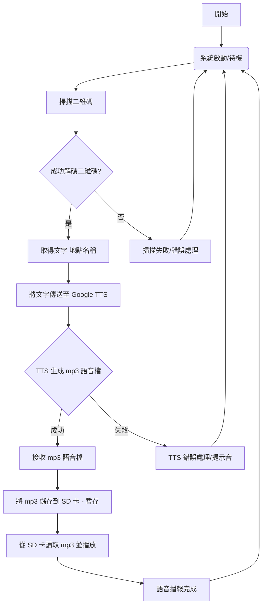

本報告旨在介紹一款專為視障人士設計的AI 盲人導航系統。該系統旨在提供即時的語音定位輔助，幫助視障者更獨立、安全地探索周遭環境。其核心功能是透過掃描特定地點的二維碼 (QR Code)，迅速獲取二維碼內嵌的文字資訊（即地點名稱）。隨後，系統會利用文字轉語音 (Text-to-Speech, TTS) 技術將這個地點名稱轉換為清晰的語音指令，並立即透過音訊輸出裝置播放出來。

- [功能](#功能)
- [GenAI程式碼設計流程](#genai程式碼設計流程)
- [程式碼產生提示](#程式碼產生提示)
- [程式碼](#程式碼)
- [實作成果](#實作成果)
  - [照片](#照片)
  - [影片](#影片)

## 功能

    掃描二維碼說出位置
    
      1. 掃描二維碼取得文字（地點名稱）
    
      2. 文字轉語音，取得文字的 mp3
    
      3. SDCardPlayMP3 播放 mp3 並說出位置名稱

## GenAI程式碼設計流程



**流程圖說明：**

* **開始 (Start)：** 系統啟動流程。
* **系統啟動/待機 (System Startup/Standby)：** 系統初始化並等待掃描觸發。
* **掃描二維碼 (Scan QR Code)：** 攝影機捕捉二維碼影像。
* **成功解碼二維碼? (Successfully Decode QR Code?)：** 判斷二維碼是否成功解析。
* **是 (Yes)：** 如果成功解碼。
* **取得文字 地點名稱 (Get Text Location Name)：** 從二維碼中提取出地點名稱文字。
* **否 (No)：** 如果解碼失敗。
* **掃描失敗/錯誤處理 (Scan Failed/Error Handling)：** 執行錯誤處理，可能會有提示音或回到待機。
* **將文字傳送至 Google TTS (Send Text to Google TTS)：** 將地點名稱文字發送到 Google Text-to-Speech 服務。
* **TTS 生成 mp3 語音檔 (TTS Generates MP3 Audio File)：** Google TTS 將文字轉換為 mp3 格式的語音。
* **成功 (Success)：** 如果 TTS 成功生成語音。
* **接收 mp3 語音檔 (Receive MP3 Audio File)：** 接收從 TTS 返回的 mp3 語音數據。
* **失敗 (Failure)：** 如果 TTS 服務失敗或超時。
* **TTS 錯誤處理/提示音 (TTS Error Handling/Prompt Tone)：** 執行錯誤處理，可能會有提示音。
* **將 mp3 儲存到 SD 卡 (暫存) (Save MP3 to SD Card (Temporary))：** 將接收到的 mp3 語音檔暫時儲存到 SD 卡。
* **從 SD 卡讀取 mp3 並播放 (Read MP3 from SD Card and Play)：** 從 SD 卡讀取該 mp3 檔案並透過音訊輸出裝置播放。
* **語音播報完成 (Voice Broadcast Complete)：** 語音播放結束。
* **返回到系統啟動/待機 (Return to System Startup/Standby)：** 系統回到初始狀態，等待下一次掃描。


## 程式碼產生提示

  
```我想請你幫我做一個滿足以下條件的程式
功能： 掃描二維碼說出位置
步驟1. 掃描二維碼取得文字（地點名稱）
步驟2. 文字轉語音，取得文字的 mp3
步驟3. SDCardPlayMP3 播放 mp3 並說出位置名稱
我將提供範例程式 如下:
```


## 程式碼

``` c
#undef DEFAULT

#include "VideoStream.h"
#include "QRCodeScanner.h"
#include "WiFi.h"
#include <WiFiUdp.h>
#include "GenAI.h"
#include "AmebaFatFS.h"

// --- NTP 時間同步相關庫 ---
#include "NTPClient.h"

// --- WiFi Configuration ---
char ssid[] = "";    // **請務必更換為您的家庭 Wi-Fi SSID！**
char pass[] = "";    // **請務必更換為您的家庭 Wi-Fi 密碼！**

// --- Camera & QR Code Scanner Configuration ---
#define CHANNEL 0
VideoSetting config(CHANNEL);
QRCodeScanner Scanner;

// --- Text-to-Speech & SD Card Playback Configuration ---
AmebaFatFS fs;
GenAI tts;
String mp3Filename = "qrcode_location.mp3"; // 儲存語音檔的名稱

// --- NTP 客戶端實例 ---
WiFiUDP ntpUDP;
// **更改 NTP 伺服器為 time.google.com，通常更穩定**
NTPClient timeClient(ntpUDP, "time.google.com", 8 * 3600); // 8 * 3600 是 UTC+8 (台灣時區)

// --- 函數原型 ---
void initWiFi();
void initNTP();
void sdPlayMP3(String filename);

void setup() {
    Serial.begin(115200);

    // 1. 初始化 WiFi 連線
    Serial.println("--- 啟動 WiFi 連線 ---");
    initWiFi();
    if (WiFi.status() != WL_CONNECTED) {
        Serial.println("WiFi 連線失敗，無法進行後續操作。請檢查 SSID/密碼或網路環境。");
        while (true); // 停止程式運行
    }

    // 2. 初始化 NTP 時間同步 (在 WiFi 連線成功後執行)
    Serial.println("\n--- 嘗試 NTP 時間同步 ---");
    initNTP();

    // 3. 配置攝影機影像通道並初始化
    Serial.println("\n--- 初始化攝影機 ---");
    Camera.configVideoChannel(CHANNEL, config);
    Camera.videoInit();

    // 4. 啟動二維碼掃描器
    Serial.println("\n--- 啟動二維碼掃描器 ---");
    Scanner.StartScanning();

    Serial.println("\n系統已啟動，等待掃描二維碼...");
}

void loop() {
    delay(1000); // 控制掃描結果的檢索頻率

    Scanner.GetResultString();
    Scanner.GetResultLength();

    if (Scanner.ResultString != nullptr && Scanner.ResultLength != 0) {
        String locationName = String((char*)Scanner.ResultString); // 修正中文亂碼問題

        Serial.print("掃描到二維碼內容: ");
        Serial.println(locationName);

        // 避免重複播放相同內容
        static String lastScannedContent = "";
        if (locationName != lastScannedContent) {
            lastScannedContent = locationName;

            Serial.print("正在將文字轉換為語音: ");
            Serial.println(locationName);
            // 語音轉換，語言代碼為 "zh-TW" (繁體中文)
            tts.googletts(mp3Filename, locationName, "zh-TW");

            // 給予足夠時間讓 TTS 處理並將檔案寫入 SD 卡
            // 尤其在網路或 SD 卡速度較慢時，這個延遲很重要
            delay(000); // 從 500ms 增加到 2000ms

            Serial.print("正在播放語音: ");
            Serial.println(mp3Filename);
            sdPlayMP3(mp3Filename);
        } else {
            Serial.println("內容相同，跳過語音播放。");
        }
    }
}


// --- WiFi 初始化函數實現 ---
void initWiFi() {
    for (int i = 0; i < 3; i++) { // 增加嘗試次數
        WiFi.begin(ssid, pass);
        Serial.print("正在連接到 ");
        Serial.println(ssid);

        uint32_t StartTime = millis();
        while (WiFi.status() != WL_CONNECTED) {
            delay(500);
            if ((millis() - StartTime) > 10000) { // 等待最多 10 秒
                Serial.println("WiFi 連線超時，嘗試下一次...");
                break;
            }
        }

        if (WiFi.status() == WL_CONNECTED) {
            Serial.println("\nWiFi 連線成功！");
            Serial.print("STA IP 位址: ");
            Serial.println(WiFi.localIP());
            return;
        }
    }
    Serial.println("\nWiFi 連線失敗。請檢查 SSID 和密碼，或更換網路環境。");
}

// --- NTP 時間同步函數實現 ---
void initNTP() {
    Serial.println("初始化 NTP 時間同步...");
    timeClient.begin();
    // 嘗試更新時間，最多等待 15 秒 (增加等待時間)
    long timeout = millis();
    while(!timeClient.update() && (millis() - timeout < 15000)) {
        timeClient.forceUpdate(); // 強制更新
        Serial.print(".");
        delay(1000); // 每次嘗試間隔 1 秒
    }
    if (timeClient.update()) {
        Serial.println("\n時間同步成功！當前時間: " + timeClient.getFormattedTime());
    } else {
        Serial.println("\n時間同步失敗！");
        Serial.println("這 **非常可能** 影響到 SSL 加密連線到 Google 翻譯。");
        Serial.println("請檢查：1. 您的網路是否阻擋 NTP (UDP 123 埠)？ 2. 您的板子韌體/庫是否最新？");
    }
}

// --- SD 卡播放 MP3 函數實現 ---
void sdPlayMP3(String filename) {
    fs.begin();
    String filepath = String(fs.getRootPath()) + filename;
    File file = fs.open(filepath, MP3);

    if (!file) {
        Serial.print("--- 無法打開 MP3 檔案: ");
        Serial.println(filepath);
        Serial.println("可能是檔案不存在，或檔案已損壞，或 SD 卡有問題。");
        fs.end();
        return;
    }

    Serial.print("--- 正在設定音量並播放 MP3... ");
    file.setMp3DigitalVol(220); // 將音量提高到 220 (最大 255)
    file.playMp3();
    Serial.println("播放完畢或中斷。");
    file.close();
    fs.end();
}
```

## 實作成果

### 照片

1. QRcode偵測 Demo    
  


### 影片

Demo影片  
[](https://www.youtube.com/watch?v=muGBQxwAWqU)  
點擊圖片播放  
