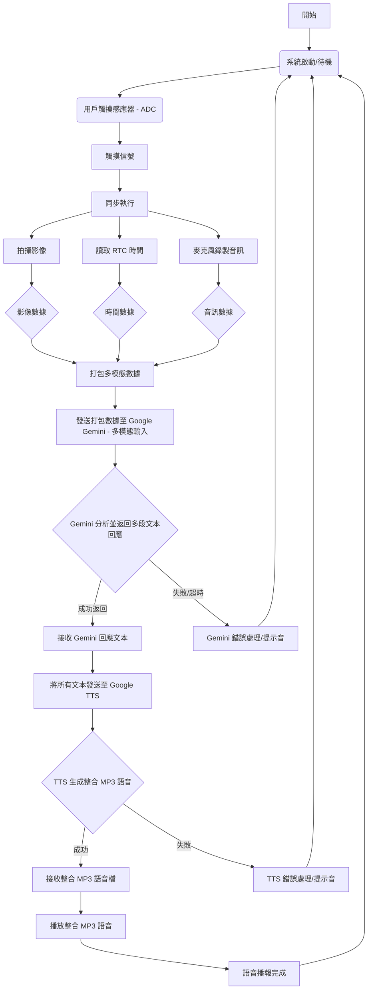

本報告旨在介紹一款創新且多功能的AI 盲人視覺輔助系統。該系統旨在透過整合多種感官輸入與先進人工智慧，為視障人士提供即時、全面的環境感知與語音導引。其核心功能包括：透過觸摸感應觸發系統；隨後，系統會拍攝當前影像並傳送至 Google Gemini Vision 詢問現場狀況；同時，它會將實時時鐘 (RTC) 時間資訊發送給 Gemini，以獲得時間相關的回應；更進一步地，系統支援麥克風錄製用戶語音並傳送給 Gemini 進行理解，AI 將返回相關文本回應，最終所有來自 Gemini 的文本都將透過文字轉語音 (TTS) 播放出來

- [功能](#功能)
- [GenAI程式碼設計流程](#genai程式碼設計流程)
- [程式碼產生提示](#程式碼產生提示)
- [程式碼](#程式碼)
- [實作成果](#實作成果)
  - [照片](#照片)
  - [影片](#影片)

## 功能

    1. 觸摸（ADC）

    2. 拍攝影像並傳送給 Gemini 並詢問現場狀況

    3. 發送 RTC時間訊息給 Gemini 並返回文本

    4. 麥克風錄製音訊並發送給 Gemini 返回文本，然後進行文本轉語音


## GenAI程式碼設計流程


**說明：**

* 我在 `B(用戶觸摸感應器 ADC);` 節點中將 `ADC` 改為 `- ADC`。
* 我在 `I --> J[發送打包數據至 Google Gemini (多模態輸入)];` 節點中將 `(多模態輸入)` 改為 `- 多模態輸入`。
* 我在 `K{Gemini 分析並返回多段文本回應};` 節點中，這個節點本身沒有括號，保持不變。
* 我在 `N{TTS 生成整合 MP3 語音};` 節點中，這個節點本身沒有括號，保持不變。

---

## 程式碼產生提示
    首先我有一個按鈕是用來啟動的

    接著我有一個鏡頭用來看環境

    TFT LCD 用來輸出回傳的文字跟鏡頭畫面

    最後我有一個喇叭要將文字轉成語音播報

    請用我給的範例 組合出符合功能的程式碼  
    
## 程式碼  

```c
#include <WiFi.h>
#include <WiFiUdp.h>          // Often included with WiFi.h for network functions
#include "GenAI.h"            // For LLM (Vision, Text) and TTS
#include "VideoStream.h"      // For Camera operations
#include "SPI.h"              // For SPI communication with LCD
#include "AmebaILI9341.h"     // For ILI9341 TFT LCD driver
#include "TJpg_Decoder.h"     // For JPEG decoder to display camera output on LCD
#include <AmebaFatFS.h>       // For SD card operations (saving MP3 for TTS)
#include "rtc.h"              // For Real-Time Clock
#include <time.h>             // For time structures (struct tm)
#include "StreamIO.h"         // For audio streaming - RE-ADDED
#include "AudioStream.h"      // For audio input (microphone) - RE-ADDED
#include "AudioEncoder.h"     // For audio encoding - RE-ADDED
#include "MP4Recording.h"     // For recording audio to MP4 - RE-ADDED
#include "Base64.h"           // For Base64 encoding - RE-ADDED
#include <ArduinoJson.h>      // For JSON parsing - RE-ADDED

// 請替換為你的網路 SSID 和密碼
char wifi_ssid[] = "";
char wifi_pass[] = "";

// --- API 金鑰 ---
String Gemini_key = ""; // <<< 重要：請替換為你的實際金鑰
String openAI_key = ""; // Not strictly needed for this example, but keep it as a placeholder. (此範例非必需，但作為佔位符保留。)
String Llama_key = "";  // Not strictly needed for this example, but keep it as placeholder. (此範例非必需，但作為佔位符保留。)

// SD Card MP3 Filename for TTS output (用於 TTS 輸出的 SD 卡 MP3 檔案名稱)
String mp3Filename = "broadcast_output.mp3";

// Audio Recording Configuration for Speech-to-Text (用於語音轉文字的音訊錄製配置)
String audioRecordFilename = "user_input"; // Filename for recorded audio
int recordSeconds = 5;                     // Duration for audio recording (e.g., 5 seconds for user query)

// Camera Configuration (相機配置)
// Adjusted resolution for troubleshooting Bus Fault / VOE initialization issues.
// Start with a lower resolution to reduce memory pressure and complexity.
VideoSetting config(320, 240, CAM_FPS, VIDEO_JPEG, 1); // FIXED: Reduced camera resolution for troubleshooting
#define CHANNEL 0 // Camera channel

uint32_t img_addr = 0; // Memory address of the captured image
uint32_t img_len = 0;  // Length of the captured image data

// Prompt message for the LLM Vision model (用於 LLM 影像模型提示訊息)
// This will be dynamically updated with time and user's voice query.
String prompt_msg_base = "請問圖片中的內容是什麼?請用繁體中文，簡潔地回答。";

// Pin Definitions (引腳定義)
const int buttonPin = 1; // The pin connected to the pushbutton (連接到按鈕的引腳)
// LED_B and LED_G are already defined in AmebaPro2's variant.h (LED_B 和 LED_G 已在 AmebaPro2 的 variant.h 中定義)

// TFT LCD Pin Definitions (TFT LCD 引腳定義)
#define TFT_RESET 5   // Reset pin
#define TFT_DC    4   // Data/Command pin
#define TFT_CS    SPI_SS // Chip Select pin (using default SPI SS)

AmebaILI9341 tft = AmebaILI9341(TFT_CS, TFT_DC, TFT_RESET); // TFT LCD object

#define ILI9341_SPI_FREQUENCY 20000000 // SPI frequency for LCD

// Constants for LCD dimensions and font sizes (for missing tft.height() and tft.getFontSize())
// (用於 LCD 尺寸和字體大小的常數，因為缺少 tft.height() 和 tft.getFontSize())
// ILI9341 is typically 240x320. With setRotation(2), it's logically 320px wide by 240px tall.
#define LCD_WIDTH_ROTATED   320
#define LCD_HEIGHT_ROTATED  240
#define FONT_SIZE_LEVEL1_PIX_HEIGHT 8  // Approximate pixel height for font size 1
#define FONT_SIZE_LEVEL2_PIX_HEIGHT 16 // Approximate pixel height for font size 2 (8 * 2)

// --- Global Objects --- (全域物件)
WiFiSSLClient client; // For secure HTTP connections to APIs (用於安全 HTTP 連接到 API)
GenAI llm;            // Object for interacting with Generative AI LLM (Gemini Vision, STT, Text)
GenAI tts;            // Object for interacting with Text-to-Speech (Google TTS)
AmebaFatFS fs;        // File system object for SD card (SD 卡檔案系統物件)

// For RTC (用於即時時鐘)
long long currentEpochSeconds = 0;
struct tm *timeinfo;

// For Audio Processing (用於音訊處理) - RE-ADDED
AudioSetting configA(1); // Audio configuration (e.g., sample rate)
Audio audio;             // Audio input from microphone
AAC aac;                 // AAC audio encoder
MP4Recording mp4;        // MP4 recording module (to save audio for STT)
StreamIO audioStreamer1(1, 1); // Stream from audio input to encoder
StreamIO audioStreamer2(1, 1); // Stream from encoder to MP4 recording

// --- Function Prototypes --- (函數原型)
void initWiFi();
void init_tft();
bool tft_output(int16_t x, int16_t y, uint16_t w, uint16_t h, uint16_t *bitmap);
void sdPlayMP3(String filename);
String getFormattedTime();

// --- Main Setup --- (主要設定)
void setup() {
    Serial.begin(115200); // Initialize serial communication for debugging (初始化序列通訊用於偵錯)

    SPI.setDefaultFrequency(ILI9341_SPI_FREQUENCY); // Set SPI frequency for LCD (設定 LCD 的 SPI 頻率)
    initWiFi(); // Initialize Wi-Fi connection (初始化 Wi-Fi 連線)

    // Initialize RTC (初始化即時時鐘)
    Serial.println("Initializing RTC...");
    rtc.Init();
    // Set initial RTC time (adjust if needed, or get from NTP later)
    // For now, setting a fixed initial time for demonstration purposes.
    // In a real application, you might want to use NTP to get accurate time.
    // (設定初始 RTC 時間（如有需要可調整，或稍後從 NTP 獲取）。
    //  目前僅設定固定初始時間用於演示。在實際應用中，你可能希望使用 NTP 獲取準確時間。)
    long long epochTime = rtc.SetEpoch(2025, 6, 12, 12, 0, 0); // Year, Month, Day, Hour, Min, Sec (年, 月, 日, 時, 分, 秒)
    rtc.Write(epochTime);

    // Configure Audio input, encoder, and MP4 recorder for Speech-to-Text - RE-ADDED
    Serial.println("Configuring audio for recording...");
    audio.configAudio(configA);
    audio.begin();
    aac.configAudio(configA);
    aac.begin();
    mp4.configAudio(configA, CODEC_AAC);
    mp4.setRecordingDuration(recordSeconds);
    mp4.setRecordingFileCount(1);
    mp4.setRecordingFileName(audioRecordFilename);
    mp4.setRecordingDataType(STORAGE_AUDIO);

    // Link audio streams: Mic -> AAC Encoder -> MP4 Recorder - RE-ADDED
    audioStreamer1.registerInput(audio);
    audioStreamer1.registerOutput(aac);
    if (audioStreamer1.begin() != 0) {
        Serial.println("ERROR: Audio StreamIO link 1 (Mic to AAC) start failed!");
    }
    audioStreamer2.registerInput(aac);
    audioStreamer2.registerOutput(mp4);
    if (audioStreamer2.begin() != 0) {
        Serial.println("ERROR: Audio StreamIO link 2 (AAC to MP4) start failed!");
    }
    audio.printInfo(); // Print audio information to serial

    // Camera Configuration (相機配置)
    Serial.println("Configuring Camera...");
    config.setRotation(0); // Set camera rotation if needed
    Camera.configVideoChannel(CHANNEL, config);
    Camera.videoInit();
    Camera.channelBegin(CHANNEL);
    Camera.printInfo(); // Print camera information to serial

    // Configure GPIO pins (配置 GPIO 引腳)
    pinMode(buttonPin, INPUT); // Button pin (assuming external pull-down if not INPUT_PULLUP)
    pinMode(LED_B, OUTPUT); // Blue LED (now correctly using the pre-defined macro)
    pinMode(LED_G, OUTPUT); // Green LED (now correctly using the pre-defined macro)

    // Initialize TFT LCD (初始化 TFT LCD)
    Serial.println("Initializing TFT LCD...");
    init_tft();
    tft.println("GenAI Vision & TTS"); // Initial message on LCD

    // Setup JPEG decoder callback for LCD (設定 JPEG 解碼器回調函數用於 LCD)
    TJpgDec.setJpgScale(1); // Set scale factor (1 = no scaling, 2 = 1/2, 4 = 1/4, 8 = 1/8)
                           // Use 1 for best quality if image size fits LCD, or higher for smaller images.
    TJpgDec.setCallback(tft_output); // Set the callback function for drawing JPEG blocks to TFT

    Serial.println("Setup complete. Waiting for button press to interact...");
    tft.setCursor(0, 50); // Move cursor down for next message
    tft.println("Press button to start");
}

// --- Main Loop --- (主循環)
void loop() {
    // Check if the button is pressed
    if (digitalRead(buttonPin) == HIGH) { // Assuming button is HIGH when pressed
        // Debounce delay (去抖延遲)
        delay(50);
        while (digitalRead(buttonPin) == HIGH); // Wait until button is released
        delay(50); // Debounce after release

        Serial.println("Button pressed! Starting interaction...");
        tft.clr(); // Clear LCD
        tft.setCursor(0, 0);
        tft.println("Speak your query:");
        digitalWrite(LED_G, HIGH); // Green LED ON while processing

        // Step 1: Indicate recording with blinking blue LED (藍色 LED 閃爍表示錄音中)
        for (int count = 0; count < 3; count++) {
            digitalWrite(LED_B, HIGH);
            delay(500);
            digitalWrite(LED_B, LOW);
            delay(500);
        }

        // Step 2: Record user's voice command for Speech-to-Text - RE-ADDED
        Serial.println("Recording audio for " + String(recordSeconds) + " seconds...");
        // Removed 'bool recordedTextSuccess =' as llm.geminiaudio returns String
        String recordedText = llm.geminiaudio(Gemini_key, audioRecordFilename, "gemini-2.0-flash", mp4, "Please transcribe the audio into text.", client);
        Serial.print("User said: ");
        Serial.println(recordedText);

        if (recordedText.length() == 0 || recordedText.indexOf("Connect to generativelanguage.googleapis.com failed.") != -1) { // Check for actual failure or error message
            Serial.println("Speech detected or transcription failed, or API connection failed. Please try again.");
            digitalWrite(LED_G, LOW);
            tft.clr();
            tft.setCursor(0, 0);
            tft.println("API/Speech failed!");
            tft.setCursor(0, FONT_SIZE_LEVEL2_PIX_HEIGHT);
            tft.println("Check WiFi/API Key/Certs."); // Added a more specific message for common issues
            delay(2000); // Wait a bit before allowing another press
            return;
        }

        // Display transcribed text on LCD
        tft.clr();
        tft.setCursor(0, 0);
        tft.println("You said:");
        tft.setFontSize(1);
        tft.println(recordedText);
        tft.setFontSize(2);
        delay(1000); // Show transcribed text for a moment

        Serial.println("Capturing image...");
        tft.clr();
        tft.setCursor(0, 0);
        tft.println("Capturing Image...");

        // Step 3: Camera take image (相機捕捉圖像)
        Camera.getImage(0, &img_addr, &img_len);
        Serial.print("Image captured: address=0x");
        Serial.print((unsigned long)img_addr, HEX);
        Serial.print(", length=");
        Serial.print(img_len);
        Serial.println(" bytes");

        // Step 4: JPEG decode image & display on TFT LCD (JPEG 解碼圖像並顯示在 TFT LCD 上)
        tft.clr(); // Clear LCD again for image display
        tft.setCursor(0, 0); // Reset cursor
        Serial.println("Displaying image on LCD...");
        TJpgDec.drawJpg(0, 0, (uint8_t *)img_addr, img_len); // Draw JPEG from memory to LCD

        // Step 5: Get current time from RTC (步驟 5：從 RTC 獲取當前時間)
        currentEpochSeconds = rtc.Read();
        String formattedTime = getFormattedTime();
        Serial.print("Current Time: ");
        Serial.println(formattedTime);

        // Step 6: Prepare prompt for LLM Vision (為 LLM 影像模型準備提示)
        // Combine current time, image description request, AND user's voice query
        String full_prompt_msg = "現在時間是 " + formattedTime + "。\n";
        full_prompt_msg += "圖片中的內容是什麼？請使用繁體中文，簡潔地回答。\n";
        full_prompt_msg += "用戶的語音查詢是：「" + recordedText + "」。請綜合圖片內容和用戶語音查詢，生成一段簡潔的繁體中文回應。";

        Serial.println("Sending prompt to LLM Vision: " + full_prompt_msg);
        tft.setCursor(0, LCD_HEIGHT_ROTATED - FONT_SIZE_LEVEL2_PIX_HEIGHT * 2); // Position text near bottom
        tft.println("Analyzing image & query...");

        // Step 7: Send image and prompt to LLM Vision (Gemini Vision)
        // (步驟 7：將圖像和提示發送給 LLM 影像模型（Gemini Vision）)
        String visionResponse = llm.geminivision(Gemini_key, "gemini-2.0-flash", full_prompt_msg, img_addr, img_len, client);
        if (visionResponse.length() == 0 || visionResponse.indexOf("Connect to generativelanguage.googleapis.com failed.") != -1) { // Check for actual failure or error message
            visionResponse = "抱歉，無法識別圖片內容或獲取回應。請再試一次。連線錯誤。"; // More specific error message
            Serial.println("LLM Vision API connection failed.");
            digitalWrite(LED_G, LOW);
            tft.clr();
            tft.setCursor(0, 0);
            tft.println("Vision API Failed!");
            tft.setCursor(0, FONT_SIZE_LEVEL2_PIX_HEIGHT);
            tft.println("Check WiFi/API Key/Certs.");
            delay(2000);
            return;
        }
        Serial.print("LLM Vision Response: ");
        Serial.println(visionResponse);

        // Step 8: Text-To-Speech & play mp3 file (文字轉語音並播放 mp3 檔案)
        tft.clr(); // Clear LCD for TTS status
        tft.setCursor(0, 0);
        tft.println("Broadcast:");
        // Display LLM response on LCD
        tft.setFontSize(1); // Smaller font for detail
        tft.println(visionResponse);
        tft.setFontSize(2); // Revert to larger font for next status

        Serial.println("Converting text to speech...");
        // Removed boolean assignment as tts.googletts is a void function.
        // Success of TTS is now primarily checked by sdPlayMP3 attempting to open the file.
        tts.googletts(mp3Filename, visionResponse, "zh-TW"); // "zh-TW" for Traditional Chinese
        delay(500); // Give some time for file to be written

        // Step 9: Play the generated MP3 (播放生成的 MP3)
        Serial.println("Playing broadcast...");
        sdPlayMP3(mp3Filename); // This function now has improved error handling

        digitalWrite(LED_G, LOW); // Green LED OFF after processing
        Serial.println("Broadcast complete. Waiting for next button press...");
        tft.setCursor(0, LCD_HEIGHT_ROTATED - FONT_SIZE_LEVEL2_PIX_HEIGHT); // Position text near bottom
        tft.println("Done. Press button.");
    }
    delay(100); // Small delay to prevent busy-waiting
}

// --- Helper Functions --- (輔助函數)

// Initialize Wi-Fi connection (初始化 Wi-Fi 連線)
void initWiFi() {
    for (int i = 0; i < 2; i++) {
        WiFi.begin(wifi_ssid, wifi_pass);
        delay(1000);
        Serial.print("Connecting to ");
        Serial.println(wifi_ssid);

        uint32_t startTime = millis();
        while (WiFi.status() != WL_CONNECTED) {
            delay(500);
            if ((millis() - startTime) > 10000) { // 10 second timeout
                Serial.println("Wi-Fi connection timed out. Retrying...");
                break;
            }
        }

        if (WiFi.status() == WL_CONNECTED) {
            Serial.println("");
            Serial.println("Wi-Fi connected!");
            Serial.print("STA IP address: ");
            Serial.println(WiFi.localIP());
            Serial.println("");
            return; // Exit function if connected
        }
    }
    Serial.println("Failed to connect to Wi-Fi after multiple attempts.");
    // In a real application, you might want to add error handling here.
}

// Initialize TFT LCD (初始化 TFT LCD)
void init_tft() {
    tft.begin();
    tft.setRotation(2); // Adjust rotation as needed for your LCD orientation
    tft.clr(); // Clear the screen
    tft.setCursor(0, 0); // Set cursor to top-left
    tft.setForeground(ILI9341_GREEN); // Set text color
    tft.setFontSize(2); // Set font size (1 is smallest, 2 is medium, etc.)
}

// Callback function for JPEG decoder to draw blocks to TFT (JPEG 解碼器繪製區塊到 TFT 的回調函數)
bool tft_output(int16_t x, int16_t y, uint16_t w, uint16_t h, uint16_t *bitmap) {
    tft.drawBitmap(x, y, w, h, bitmap); // Draw the decoded bitmap block
    return 1; // Return 1 to decode next block
}

// Play MP3 file from SD card (從 SD 卡播放 MP3 檔案)
void sdPlayMP3(String filename) {
    // Attempt to begin file system operation
    if (!fs.begin()) {
        Serial.println("ERROR: Failed to mount SD card file system!");
        return; // Exit if SD card cannot be mounted
    }

    String filepath = String(fs.getRootPath()) + filename;
    File file = fs.open(filepath, MP3); // Open file as MP3 type
    if (!file) {
        Serial.println("ERROR: Failed to open MP3 file: " + filepath + ". Does it exist?");
        fs.end(); // Ensure file system is unmounted on error
        return;
    }

    file.setMp3DigitalVol(255); // Set volume to maximum (0-255) to ensure audibility
    Serial.println("Playing MP3: " + filepath);
    file.playMp3(); // Start playback (this is non-blocking)

    // Add a delay to allow the MP3 to play.
    // In a production scenario, you might want a more sophisticated way to check if playback has finished.
    Serial.println("Waiting for MP3 playback to finish (5 seconds)...");
    delay(5000); // Example: wait 5 seconds for audio to play

    file.close();   // Close file after playback is initiated
    fs.end();       // Unmount SD card file system
    Serial.println("MP3 playback finished.");
}

// Get formatted time string from RTC (從 RTC 獲取格式化的時間字串)
String getFormattedTime() {
    timeinfo = localtime(&currentEpochSeconds);
    String timeString = "";
    // Format:YYYY-MM-DD HH:MM:SS
    timeString += String(timeinfo->tm_year + 1900);
    timeString += "-";
    if ((timeinfo->tm_mon + 1) < 10) timeString += "0";
    timeString += String(timeinfo->tm_mon + 1);
    timeString += "-";
    if (timeinfo->tm_mday < 10) timeString += "0";
    timeString += String(timeinfo->tm_mday);
    timeString += " ";
    if (timeinfo->tm_hour < 10) timeString += "0";
    timeString += String(timeinfo->tm_hour);
    timeString += ":";
    if (timeinfo->tm_min < 10) timeString += "0";
    timeString += String(timeinfo->tm_min);
    timeString += ":";
    if (timeinfo->tm_sec < 10) timeString += "0";
    timeString += String(timeinfo->tm_sec);
    return timeString;
}

```

## 實作成果

### 照片

設備圖  


Damo(全)的序列阜輸出結果


### 影片
 
**小Damo**  
  
[](https://www.youtube.com/watch?v=jzz600KlVgc)  
點擊圖片播放  
  
  


**Damo(全)** 

[](https://www.youtube.com/watch?v=7egU_T91SW0)  
點擊圖片播放

